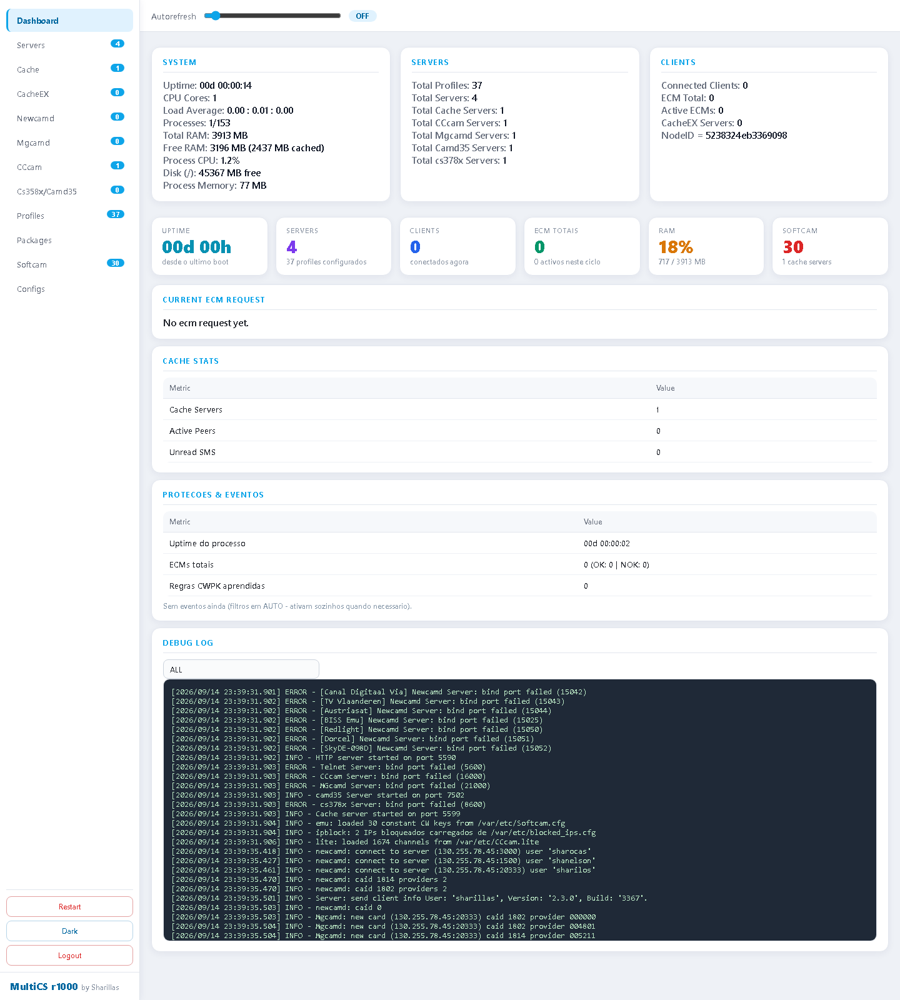
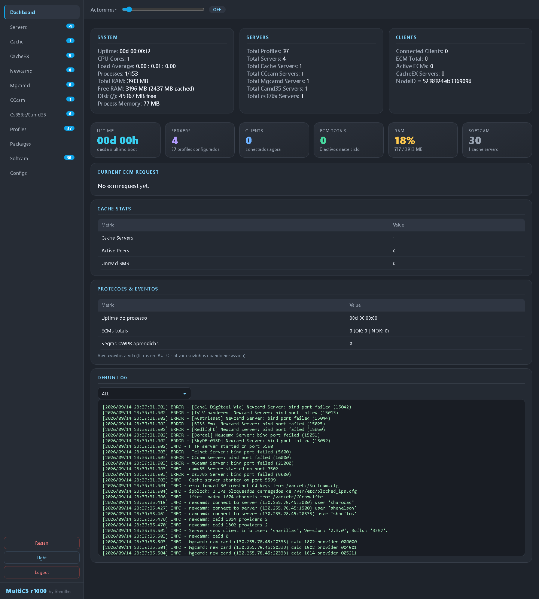

# MultiCS r1000 v1.10.9 - by Sharillas

Cardserver proxy com GUI web moderna, Softcam BISS/CW, proteção SKIPCWC contra CWs falsas, CWC (CW Cycle Check), NAGRA protection, Health scoring, Fallback cross-protocol, Timing budget, BUILD LITE, login com sessões, temas Dark/Light e dezenas de fixes.

> **Versão:** v1.10.9 | **Licença:** Sharillas@2026

---

## Dashboard

| Light mode | Dark mode |
|---|---|
|  |  |

---

## Instalação (qualquer VPS Linux x86/x64)

Os binários são **estáticos musl** — correm em Debian, Ubuntu, CentOS, Rocky, Alma, Arch, Alpine… sem dependências.

```bash
git clone https://github.com/sharillas/MultiCS-r1000-Sharillas.git
cd MultiCS-r1000-Sharillas
sudo bash install.sh
```

O instalador:
- detecta a arquitetura (x64/x32) e o sistema de serviços (systemd → init.d → crontab @reboot)
- instala binários em `/opt/multics` e configs em `/var/etc`
- cria o serviço `multics` (auto-start no boot)
- abre a porta da web UI no firewall (ufw/firewalld)
- faz smoke test à web UI

Opcional:

```bash
# pasta diferente para os binários
sudo bash install.sh /meu/caminho

# credenciais web personalizadas
sudo HTTP_USER=admin HTTP_PASS=minhasenha bash install.sh
```

Depois abre `http://SEU_IP:5500` → login (default `admin`/`admin`) → **Dashboard**.

---

## Portas

| Serviço | Porta |
|---|---|
| Web UI (HTTP) | 5500 |
| Telnet (gestão) | 5600 |
| CCcam (F-lines) | 16000 |
| MGcamd | 21000 |
| Newcamd (perfil) | 15001+ (definido no PORT de cada perfil) |
| camd35 | 7502 |
| cs378x | 8600 |
| Cache | 5599 |

---

## Configuração do cardserver (resumo)

Os configs vivem em `/var/etc/`:

| Ficheiro | O que faz |
|---|---|
| `multics.cfg` | **Mestre**: portas, credenciais, cache, telnet, HTTP e INCLUDEs |
| `profiles.cfg` | **Perfis de saída** (portas virtuais newcamd): CAID, PROVIDERS, DCW checks, SKIPCWC… |
| `1-Clients.cfg` | **F-lines** (clientes CCcam) |
| `Nlines.cfg` | **N-lines** (readers newcamd) |
| `users.cfg` | Utilizadores globais (antes dos profiles!) |
| `Mgcamd.cfg` / `Camd35.cfg` | Utilizadores MGcamd / camd35 + cs378x |
| `Cache.cfg` | Peers de cache |
| `CacheEX.cfg` | Readers CacheEX (`C: ... { cacheex_mode=3 }`) |
| `Softcam.cfg` | Chaves CONSTCW (BISS/Tandberg) — gerido pelo Emulator |

Guia detalhado com exemplos reais: **[docs/CONFIGS.md](docs/CONFIGS.md)**

Fluxo mínimo para funcionar:

1. Define o teu CAID no perfil (`profiles.cfg`): `[Meu Perfil]` + `PORT: 15001` + `CAID: XXXX`
2. Adiciona readers: `N:` (newcamd) ou `C:` (cccam) com o teu servidor
3. Adiciona clientes: `F:` (CCcam) ou `USER:`/N-lines nos perfis
4. `systemctl restart multics` (ou usa **Edit Config** — aplica na hora)
5. Vê os clientes na GUI: Newcamd / CCcam / Mgcamd…

---

## Features desta build

- **GUI moderna**: Dashboard com estatísticas, tabelas sortáveis, temas Dark/Light, login com sessões, logout
- **Emulator**: upload SoftCam.Key (Convert & Load), chaves BISS/Tandberg, página própria, botões **Update SoftCam.Key** (download remoto) e **Reload Keys**
- **SKIPCWC** (default ON): ignora CWs idênticas repetidas (fakes) — configurável por perfil
- **CWC — CW Cycle Check** (estilo OSCam): aprende o ciclo CW0/CW1 de cada canal e descarta CWs fora do ciclo, ECMs antigos (replay) e bad CW cycles — por perfil
- **NAGRA protection** (18xx/19xx/1a0x): checksum das 4 quads, provider, aprendizagem do ciclo (6 amostras), similaridade, duplicate/conflicting/fake half — por perfil
- **Health scoring**: ordena os servers por saúde (sucesso, latência, estabilidade, erros) e exclui os doentes (DROPOFF) — por perfil
- **Fallback cross-protocol**: ordem de preferência de protocolos por perfil (NEWCAMD/CCCAM/CAMD35/CS378X/RADEGAST) com timeout
- **Timing budget**: usa o cryptoperiod estimado para falhar cedo e dar tempo ao cliente de pedir o próximo ECM (ADAPTIVETTL) — por perfil
- **DCW MINTIME / DCW CYCLE_CHECK**: tempo mínimo entre CWs e alternância obrigatória da metade que muda (NDS) — por perfil
- **BUILD LITE**: filtro de canais activos (CCcam.lite) — o perfil ignora ECMs fora da lista (`Ignored (lite)`)
- **ENABLE EMULATOR BISS** por perfil (liga/desliga o emulador em cada perfil)
- **Ferramentas GUI**: Update/Load Channel Info (KingOfSat → CCcam.channelinfo) e Update SoftCam.Key na web UI
- **Edit Config / Edit Profiles** com aplicação imediata (sem restart)
- **Restart fiável** em qualquer setup (systemd, crontab, paths diferentes)
- **Linhas de debug por cliente** (botão DBG em todas as tabelas)
- **Proteções de DCW**: checksum, null DCW, bad DCW, nanoE0 (viaccess), filtros cache CAID 0500
- Zero erros de parsing com os configs de exemplo

Lista completa de fixes e implementação: **[docs/IMPLEMENTACAO.md](docs/IMPLEMENTACAO.md)**

---

## Desenvolvimento (Windows)

```powershell
# compilar (cross-compile Zig 0.15.2, sem Linux)
powershell -ExecutionPolicy Bypass -File build.ps1

# empacotar (dist/)
powershell -ExecutionPolicy Bypass -File package.ps1

# deploy para VPS (scp+ssh)
powershell -ExecutionPolicy Bypass -File deploy.ps1 -Host "IP_VPS"

# teste local WSL
bash test.sh
```

Build flags (equivalentes ao Makefile original):
`-DCHECK_NEXTDCW -DSID_FILTER -DNEWCACHE -DCCCAM_CLI -DRADEGAST_CLI -DCAMD35_CLI -DCS378X_CLI -DHTTP_SRV -DTELNET -DMGCAMD_SRV -DCCCAM_SRV -DCAMD35_SRV -DCS378X_SRV -DSRV_CSCACHE -DEXPIREDATE -DDCWSWAP -DCACHEEX -DIPLIST -DTESTCHANNEL -DTHREAD_DCW -DEPOLL_NEWCAMD -DEPOLL_CCCAM -DEPOLL_MGCAMD -DEPOLL_ECM -DPEERLIST -DECMLIST -DEPOLL_FREECCCAM -std=gnu90 -O3 -fpack-struct`

---

## Segurança

- **Muda já** o `HTTP USER/PASS` e `TELNET USER/PASS` no `multics.cfg`
- Expõe só as portas que precisas (a web UI 5500 é a mais sensível)
- Binários estáticos: sem dependências da libc da VPS

---

## Créditos

Base: (evileyes). Mod, GUI e fixes: **Sharillas@2026** — v1.10.9
